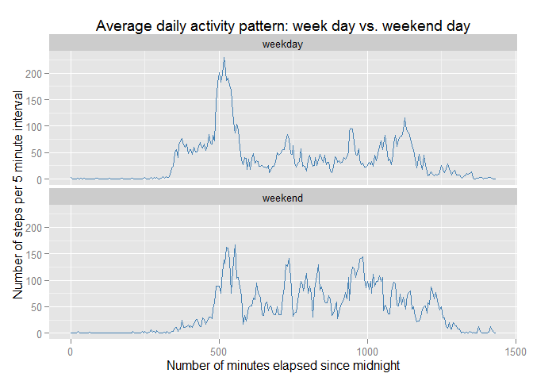

# Reproducible Research: Peer Assessment 1

## Introduction

This assignment makes use of data from a personal activity monitoring device. This device collects data at 5 minute intervals through out the day. The data consists of two months of data from an anonymous individual collected during the months of October and November, 2012 and include the number of steps taken in 5 minute intervals each day.

The data for this assignment is available [here](https://d396qusza40orc.cloudfront.net/repdata%2Fdata%2Factivity.zip).

The variables included in this dataset are:

+ **steps**: Number of steps taking in a 5-minute interval (missing values are coded as NA)
+ **date**: The date on which the measurement was taken in YYYY-MM-DD format
+ **interval**: Identifier for the 5-minute interval in which measurement was taken

The dataset is stored in a comma-separated-value (CSV) file and there are a total of 17,568 observations in this dataset.

## Loading and preprocessing the data

First load the data assuming the source file is in the current directory:

```r
activity <- read.csv("activity.csv", stringsAsFactors = FALSE)
summary(activity)
```

```
##      steps            date              interval     
##  Min.   :  0.00   Length:17568       Min.   :   0.0  
##  1st Qu.:  0.00   Class :character   1st Qu.: 588.8  
##  Median :  0.00   Mode  :character   Median :1177.5  
##  Mean   : 37.38                      Mean   :1177.5  
##  3rd Qu.: 12.00                      3rd Qu.:1766.2  
##  Max.   :806.00                      Max.   :2355.0  
##  NA's   :2304
```
Next load the packages we will be using. We suppress the messages printed when lodaing these packages.

```r
library(ggplot2)
library(dplyr)
```
Finally we preprocess the data.

First transform the date field into an R date format using the current time zone. Note that the `as.POSIXct` function knows how to handle dates formatted as in the spreadsheet, namely "2012-10-01".

```r
activity$date <- as.POSIXct(activity$date)
```
We look at the first few observations:

```r
head(activity)
```

```
##   steps       date interval
## 1    NA 2012-10-01        0
## 2    NA 2012-10-01        5
## 3    NA 2012-10-01       10
## 4    NA 2012-10-01       15
## 5    NA 2012-10-01       20
## 6    NA 2012-10-01       25
```
The `interval` variable values appear to the numbers of minutes elapsed since midninght of the corresponding day in increment of $5$ minutes. However, the value following $55$ is $100$ not $60$. The maximum value in a day is $2355$ which is much larger than the actual number of minutes in a day. The format of `interval` is a kind of numerical version of the `hours:minutes` format without the semicolon (and with all leading zeroes removed.) This is not very useful to plot our time series (see below) so we build a new variable that truly counts the number of minutes elapsed since midnight in $5$ minute increments:

```r
activity$minutesSinceMidnight <-
  floor(activity$interval/100) * 60 + activity$interval %% 100
```
For each day, `minutesSinceMidnight` ranges from $0$ to $1435$ since there are $1440$ minutes in a day.

```r
summary(activity$minutesSinceMidnight)
```

```
##    Min. 1st Qu.  Median    Mean 3rd Qu.    Max. 
##     0.0   358.8   717.5   717.5  1076.0  1435.0
```

## What is mean total number of steps taken per day?

Note: we are told to ignore the missing values in this part of the assignment which we take to mean removing these values from the computations using `na.rm = TRUE`.

1. Compute the number of steps per day removing missing values:

```r
tot_steps_by_day <- activity %>%
  group_by(date) %>%
  summarise(totalSteps = sum(steps, na.rm = TRUE))
```

2. Make a histogram of the number of steps taken per day. Note that we use `ggplot2` default bin width.

```r
g <-ggplot(tot_steps_by_day, aes(x = totalSteps)) +
  geom_histogram(fill = "salmon", color = "black") +
  xlab("Total number of steps per day") + 
  ggtitle("Histogram of the total number of steps per day (missing data removed)")
g
```

 

3. Compute the mean and median values of the total number of steps taken per day:

```r
mean(tot_steps_by_day$totalSteps)
```

```
## [1] 9354.23
```

```r
median(tot_steps_by_day$totalSteps)
```

```
## [1] 10395
```

## What is the average daily activity pattern?

1. Make a time series plot of the $5$-minute interval and the average number of steps taken within the interval, averaged across all days. First compute the averages:

```r
avge_by_interval <- activity %>%
  group_by(minutesSinceMidnight) %>%
  summarize(avgeSteps = mean(steps, na.rm = TRUE))
```
This dataset has $288$ rows, namely the number of $5$ minute intervals in a day.

```r
g = ggplot(avge_by_interval, aes(x=minutesSinceMidnight, y=avgeSteps)) +
  geom_line(color="steelblue") +
  xlab("Number of minutes elapsed since midnight") +
  ylab("Number of steps per 5 minute interval") +
  ggtitle("Average daily activity pattern for October and November 2012")
g
```

 

2. We compute the $5$ minute interval that contains the maximum number of steps on average across all the days in the dataset:

```r
which(avge_by_interval$avgeSteps == max(avge_by_interval$avgeSteps))
```

```
## [1] 104
```
The value $104$ corresponds to about 8:40 a.m. Indeed, $104*5/60$ is about $8.666667$.

## Imputing missing values
1. We compute the total number of missing `steps` values:

```r
sum(is.na(activity$steps))
```

```
## [1] 2304
```
These missing values come from $8$ days that do not have any recorded `steps` values for a total of $8 * 288 = 2304$ values:

```r
dayNA = activity %>% 
  group_by(date) %>% 
  summarise(numNA = sum(is.na(steps))) %>% 
  filter(numNA > 0)
dayNA
```

```
## Source: local data frame [8 x 2]
## 
##         date numNA
##       (time) (int)
## 1 2012-10-01   288
## 2 2012-10-08   288
## 3 2012-11-01   288
## 4 2012-11-04   288
## 5 2012-11-09   288
## 6 2012-11-10   288
## 7 2012-11-14   288
## 8 2012-11-30   288
```

2. We impute the missing values using the mean number of steps per $5$ minute interval across all days as computed in the previous section and rounded to the nearest integer.

3. We create a new dataset, `activityImputed`, that is equal to the original dataset but with the missing data filled in as described above. We loop over the $8$ days with all `steps` values missing and we replace all the `NA` values for the day with the (rounded) vector of average `steps` values, namely `avge_by_interval$avgeSteps`. 

```r
activityImputed <- activity  # make a copy of the dataset
for (dayIdx in dayNA$date)   # loop over the days with missing steps values
  activityImputed[activityImputed$date == dayIdx,]$steps = round(avge_by_interval$avgeSteps,0)
```
We verify that there are no longer any missing `steps` values in the new dataset.

```r
sum(is.na(activityImputed$steps))
```

```
## [1] 0
```

4. We compute the total number of steps taken each day from the imputed data:

```r
tot_steps_by_dayImputed <- activityImputed %>%
  group_by(date) %>%
  summarise(totalSteps = sum(steps, na.rm = TRUE))
```
And we make the corresponding histogram:

```r
g <-ggplot(tot_steps_by_dayImputed, aes(x = totalSteps)) +
  geom_histogram(fill = "salmon", color = "black") +
  xlab("Total number of steps per day") + 
  ggtitle("Histogram of the total number of steps per day (using imputed data)")
g
```

 

We compute the new `mean` and `median` values of the total number of steps:

```r
mean(tot_steps_by_dayImputed$totalSteps)
```

```
## [1] 10765.64
```

```r
median(tot_steps_by_dayImputed$totalSteps)
```

```
## [1] 10762
```
Observe that the new values for the `mean` and `median` are now essentially equal while the values obtained above when removing NA values were substantially different, with the value of the `mean` less than that of the `median`. This is not surprising since after removing the missing values we had $8$ days whose total number of `steps` were `0` therefore contributing nothing to the numerator in the computation of the `mean` but contributing to the denominator. Replacing these $0$ values with the `mean` forces the new `mean` to be greater.

## Are there differences in activity patterns between weekdays and weekends?
1. We create a new factor in the dataset with two levels, `weekday` and `weekend` indicating whether a given date is a weekday or weekend day. We use the function `weekdays` which takes a date and returns a string description of the corresponding day, namely `Monday`, 'Tuesday', etc. 

```r
activityImputed <- activityImputed %>%
  mutate(dayType = ifelse(weekdays(date) %in% c('Saturday','Sunday'), 'weekend', 'weekday'))
activityImputed$dayType <- factor(activityImputed$dayType)
```
2. We compute the average number of steps taken, averaged across all weekday days or weekend days.

```r
avge_by_intervalWeekday <- activityImputed %>%
  group_by(minutesSinceMidnight, dayType) %>%
  summarize(avgeSteps = mean(steps))
```
And we plot the corresponding time series for week days and for weekend says:

```r
g = ggplot(avge_by_intervalWeekday, aes(x=minutesSinceMidnight, y=avgeSteps)) +
  geom_line(color="steelblue") +
  facet_wrap(~ dayType, ncol = 1) +
  xlab("Number of minutes elapsed since midnight") +
  ylab("Number of steps per 5 minute interval") +
  ggtitle("Average daily activity pattern: week day vs. weekend day")
g
```

 

We observe definite differences in activity patterns between week days and weekend days. Activity starts earlier on week days (around 6:30 a.m.) and peaks higher around 9:00 a.m. However, we observe higher activity levels on weekend days between mid-morning and about 8:30 p.m. than during week days. Furthermore, the activity variation appears higher on weekends than on week days.


